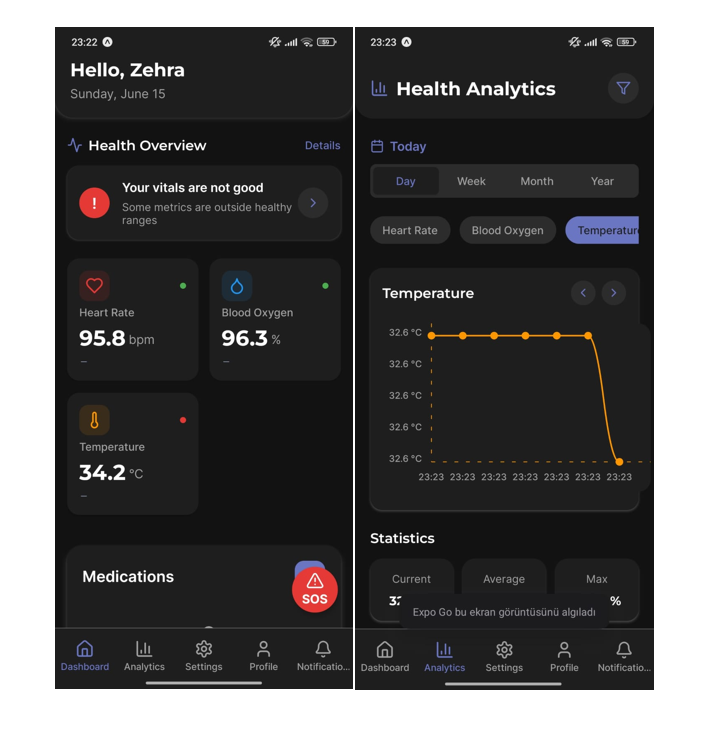

# IoT-Based Embedded Health Monitoring System

## Project Overview

This final year thesis project integrates an IoT-based embedded health monitoring system with a mobile application for comprehensive real-time health tracking and emergency management. The system collects vital biometric data and allows remote monitoring via a user-friendly mobile app, designed especially for elderly users.

## Hardware Components

* **NodeMCU ESP8266:** 32-bit microcontroller with built-in Wi-Fi support
* **MAX30102:** Heart rate (pulse) sensor
* **GY-906:** Temperature sensor
* **GYNEOMV2:** GPS sensor for location tracking
* **MPU6050:** Accelerometer sensor for motion and fall detection

### Sensor Connections

* **I2C (D1, D2 pins):** MAX30102, GY-906, MPU6050
* **UART (D7, D8 pins):** GYNEOMV2 GPS sensor

## Mobile Application

* Developed with **React Native** and runs using **Expo Go**
* Compatible with both Android and iOS devices
* Features include:

  * Real-time visualization of heart rate, SpO₂, and temperature data with graphical charts
  * Data filtering by daily, weekly, and monthly periods
  * Fall detection alerts and automatic emergency notifications
  * SOS button for immediate help
  * Medication reminders with scheduled notifications
  * Emergency alerts include GPS location accessible via Google Maps

## Database

* **Firebase Realtime Database** for real-time data storage and synchronization

## Setup and Usage

### Hardware Setup

* Connect the sensors to the NodeMCU according to the specified pins.
* Ensure stable power supply and connections for reliable data acquisition.

### Software Setup

1. Install [Arduino IDE](https://www.arduino.cc/en/software) and add ESP8266 support.
2. Configure Wi-Fi and Firebase credentials in the source code.
3. Upload the firmware to the NodeMCU.
4. Launch the mobile application via Expo Go to monitor live health data and receive alerts.

İstersen bu README’yi sana Markdown dosyası olarak da hazırlayabilirim, ya da dilersen direkt GitHub’a kopyalayabilirsin. Başka eklemek istediğin bir şey var mı?
